# Library Management System 📚

Welcome to the **Library Management System**! This application is designed to manage a library's book collection, users, and borrowing system. It allows users to view available books, borrow them, and track their borrowing history, while also managing user details.

---

## Demo's Images for Different Operations

### User Interface 
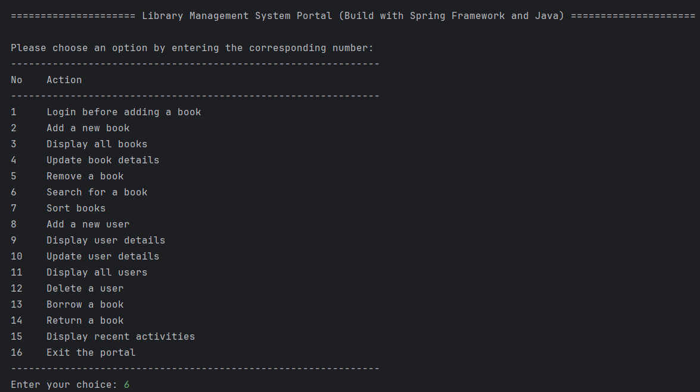

---

### Add User 
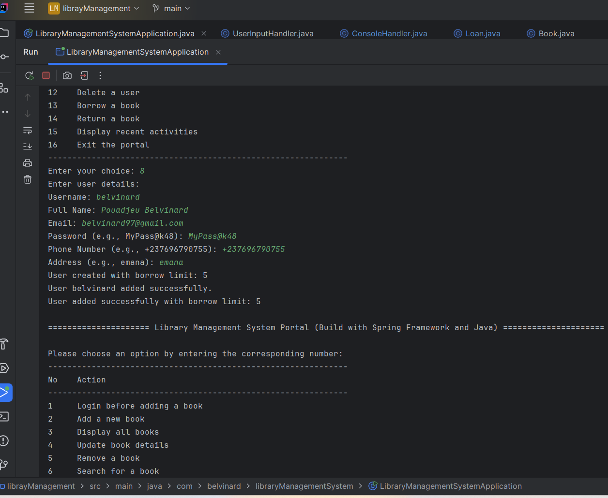

---

### Display User Details 
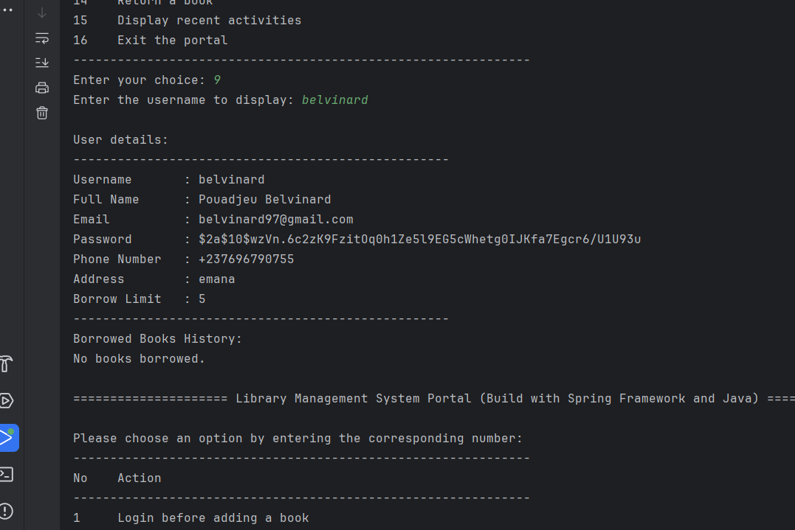

---

### Add Book 
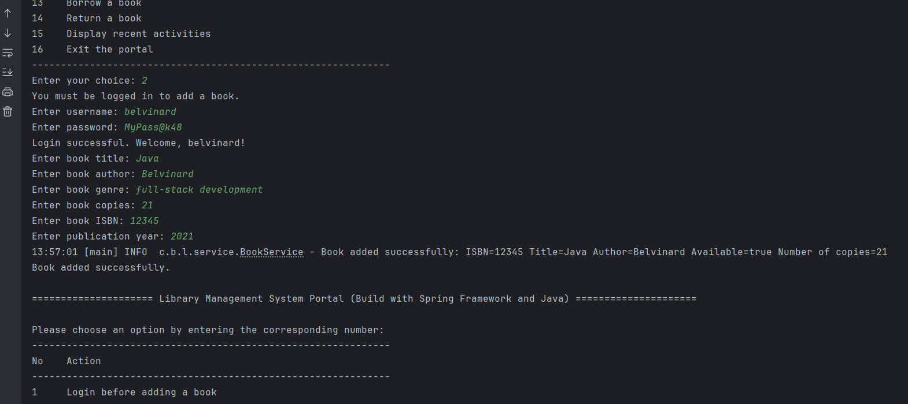

---

### Display All Books 
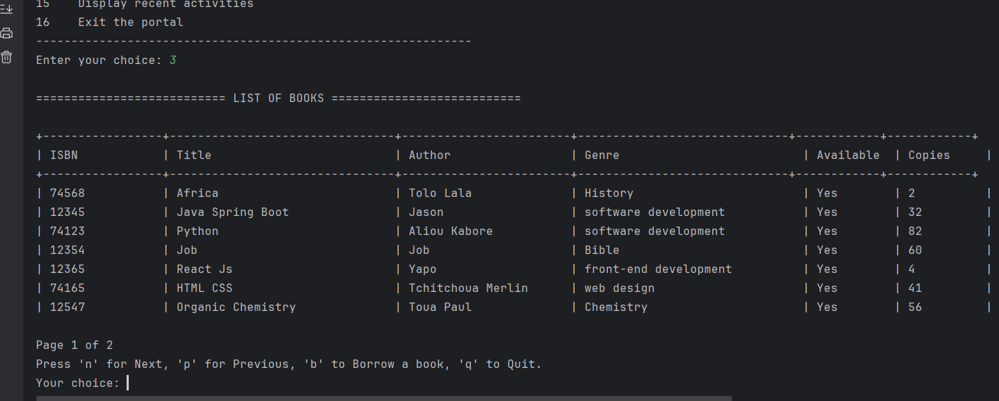

---

### Update Book 
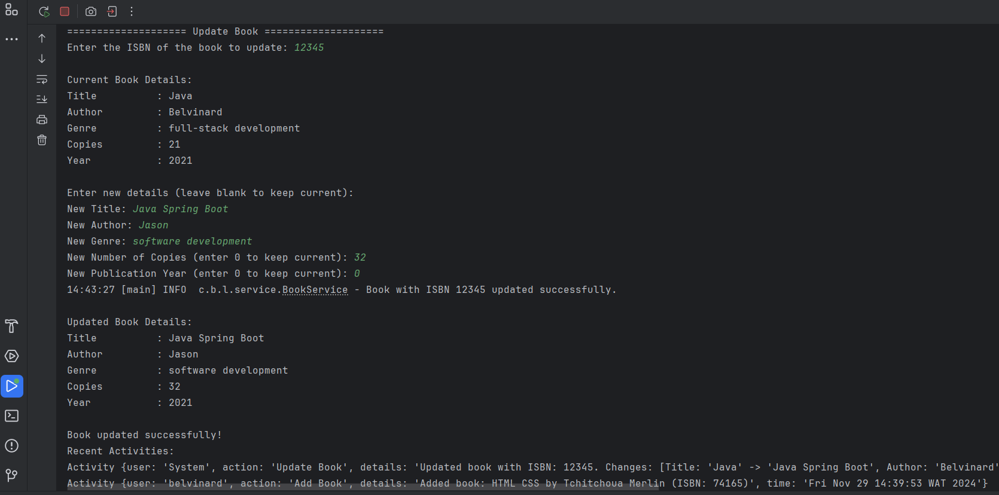

---

### Borrow Book 
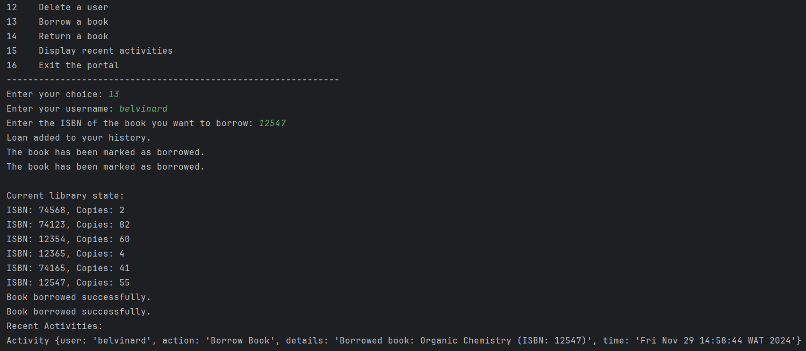

---

### Return Book 
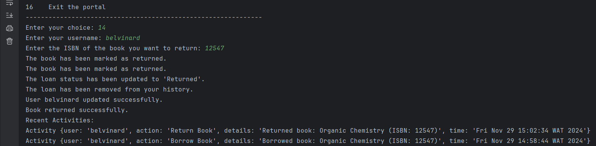

---

### Remove Book 
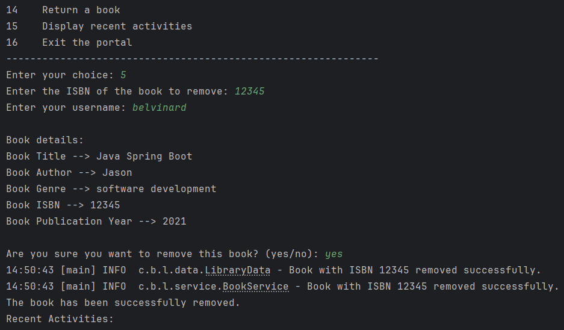

---

### Display All Users 
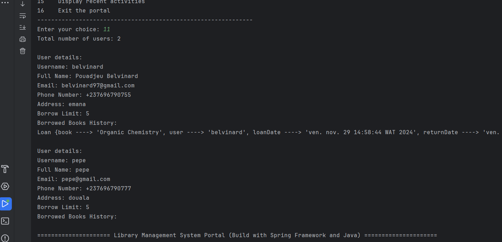

---

### Search Books 


---

### Sort Books 
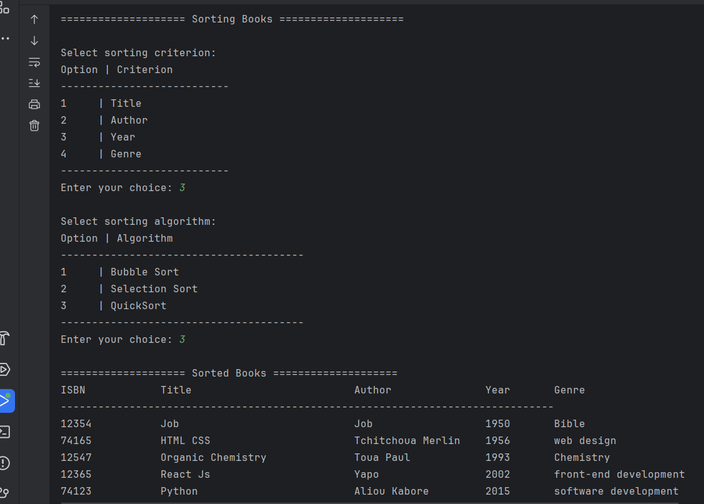

---

### Update User 


---

### Display Recent Activities 
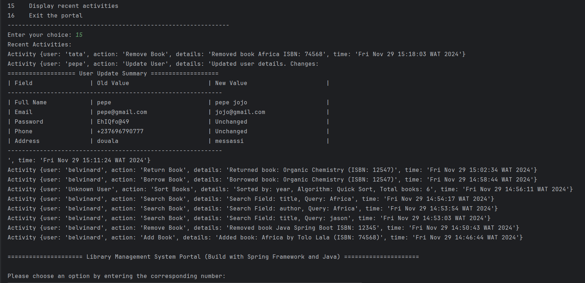

---

### Login User 
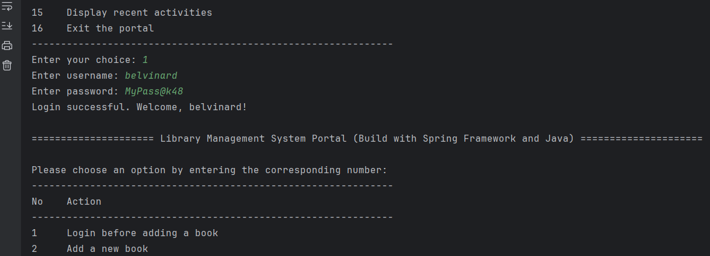

[Link to Google](https://www.google.com)


---

## Table of Contents 📑
- [Description](#description-💬)
- [Features](#features-🌟)
  - [User Management 👤](#user-management-👤)
  - [Book Management 📚](#book-management-📚)
  - [Navigation and Search 🔎](#navigation-and-search-🔎)
  - [Sorting Functionality 📊](#sorting-functionality-📊)
  - [Data Structures 📂](#data-structures-📂)
  - [User Interface 🖥️](#user-interface-🖥️)
  - [Testing 🧪](#testing-🧪)
  - [Integration and Scalability 🔧](#integration-and-scalability-🔧)
- [Technologies Used](#technologies-used-⚙️)
- [Packages Explained 📦](#packages-explained-📦)
- [Setup Instructions ⚡️](#setup-instructions-⚡️)
- [License 📜](#license-📜)


---

## Description 💬

The **Library Management System** is a console-based application that allows users to:
- **Browse a list of books** 📖
- **Borrow and return books** 🔄
- **View book details** 🔍
- **Manage user accounts** 🧑‍💻

With this system, administrators can manage the library collection, track the status of borrowed books, and maintain a secure user management system (with hashed passwords). The system also allows pagination for large collections, making it easy to navigate.

---

## Features 🌟

### User Management 👤
- **View user details**: Display information such as username, full name, email, phone number, borrow limit, and borrowed books history.
- **Password Hashing**: User passwords are securely stored with BCrypt hashing.
- **User History**: View the borrowing history of a user, including the status of returned books.

### Book Management 📚
- **View all books**: Browse through the list of books with details like ISBN, title, author, genre, availability, and number of copies.
- **Pagination**: Navigate through large collections easily.
- **Borrow and Return**: Users can borrow books, reducing the available copies. Books are marked unavailable when all copies are borrowed.
- **Add, Remove, and Update Books**: Manage books with title, author, ISBN, publication year, and genre.

### Navigation & Search 🔎
- **Easy Navigation**: Use 'Next' and 'Previous' options to browse books.
- **Search by ISBN, Title, or Author**: Perform efficient searches using linear and binary search algorithms.

### Sorting Functionality 📊
- **Sort by Title, Author, or Publication Year**: Sort books alphabetically or chronologically using bubble sort, selection sort, or quick sort algorithms.

### Data Structures 📂
- **Array**: Store books with fast retrieval.
- **Linked List**: Manage borrowing history efficiently.
- **Stack**: Track recent user activities.

### User Interface 🖥️
- **Console Interface**: Simple text-based navigation for adding, removing, searching, sorting, and borrowing books.

### Testing 🧪
- Comprehensive test cases for search, sort, book management, and edge cases (e.g., empty lists, invalid inputs).

### Integration and Scalability 🔧
- **Spring Annotations**: Use `@Component`, `@Autowired`, and `@Service` for dependency injection.
- **Well-Organized Packages**: Structured codebase for maintainability.

---

## Technologies Used ⚙️

- **Java 17** ☕️: Programming language.
- **Spring Framework** 🌱: For managing application flow.
- **BCrypt** 🔒: Password hashing.
- **SLF4J & Logback** 📜: Logging activities.
- **JUnit** 🧪: For testing.
- **Maven** 🛠️: Dependency management.

---

## Packages Explained 📦

### `console` 🎮
Handles user interaction, input, and output.

### `model` 📖
Stores data models for books, users, and loans.

### `service` 💼
Implements logic like borrowing books and sorting algorithms.

### `exception` ⚠️
Handles custom exceptions.

---

## Setup Instructions ⚡️

### Prerequisites
- Java 17 or later
- Maven


### Steps to Run the Application 🏃‍♂️

1. **Clone the repository**:
```bash
   git clone https://github.com/belvip/libraryManagement.belvinard.com.git
   cd LibraryManagementSystem
  ```
   
2. **Build the project:**
```bash
   mvn clean install
  ```

3. **Run the application:**
```bash
   mvn spring-boot:run

  ```

4. **Run the application:**
```bash
   mvn test

  ```

**License 📜**
This project is licensed under the MIT License. Feel free to use, modify, and distribute this project!


